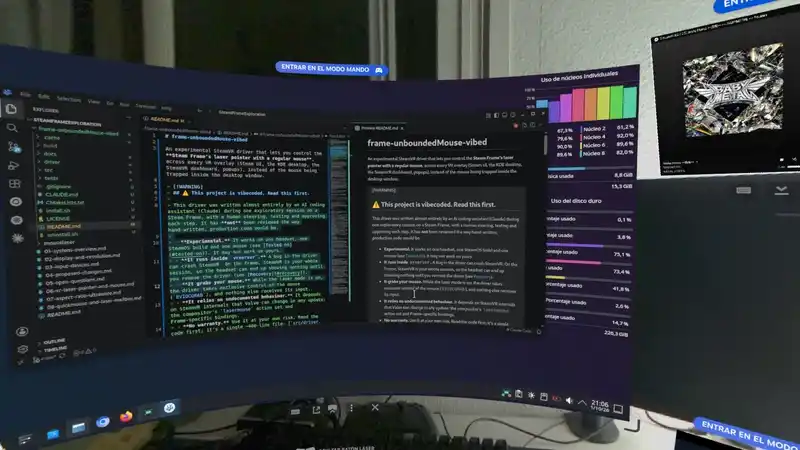

# frame-unboundedMouse-vibed

An experimental SteamVR driver that lets you control the **Steam Frame's laser pointer with a regular mouse**, across every VR overlay (Steam UI, the KDE desktop, the SteamVR dashboard, popups), instead of the mouse being trapped inside the desktop window.

<p align="center">
  
</p>

> [!WARNING]
> ## ⚠️ This project is vibecoded. Read this first.
>
> This driver was written almost entirely by an AI coding assistant (Claude) during one exploratory session on a Steam Frame, with a human steering, testing and approving each step. It has **not** been reviewed the way hand-written, production code would be.
>
> - **Experimental.** It works on one headset, one SteamOS build and one mouse (see [Tested on](#tested-on)). It may not work on yours.
> - **It runs inside `vrserver`.** A bug in the driver can crash SteamVR. On the Frame, SteamVR is your whole session, so the headset can end up showing nothing until you remove the driver (see [Recovery](#recovery)).
> - **It grabs your mouse.** While the laser mode is on, the driver takes exclusive control of the mouse (`EVIOCGRAB`), and nothing else receives its input.
> - **It relies on undocumented behaviour.** It depends on SteamVR internals that Valve can change in any update: the compositor's `lasermouse` action set and Frame-specific bindings.
> - **No warranty.** Use it at your own risk. Read the code first; it's a single ~400-line file: [`src/driver.cpp`](src/driver.cpp).

## What it does

The Frame's laser pointer is drawn by SteamVR's compositor. The compositor aims it with whatever tracked device supplies a *pose*, normally a controller. A physical mouse never reaches that system: gamescope consumes it and clamps it to whichever window has focus.

This driver adds a **virtual controller** to SteamVR:
- **Position:** follows your head.
- **Direction:** aimed by mouse movement.
- **Buttons:** your mouse buttons.

The compositor then treats it like any other laser-pointing hand.

| Mouse | Laser mode OFF (default) | Laser mode ON |
|---|---|---|
| Forward side button (BTN_EXTRA) | **Turns laser mode on** | **Turns laser mode off** |
| Movement | Normal desktop cursor | Aims the laser (world-locked: turning your head doesn't move it) |
| Left / right / middle button | Normal | Laser click / right click / middle click |
| Back side button (BTN_SIDE) | Normal | SteamVR's laser **Back**, the same action as the right Frame controller's B button. Works in Steam UI menus; it does not reach the KDE desktop (see Known limitations). |
| Wheel (and tilt wheel) | Normal | Acts like the controller **thumbstick**. One notch moves one item in Steam UI lists, and spinning the wheel scrolls continuously. It also scrolls the overlay under the laser. |

When laser mode turns on, the ray starts where you're looking. When it's off, the virtual device stays connected but parks its ray pointing at the sky with every button released, so your real controllers keep the laser.

Since 0.5.0 the virtual device registers as a **stylus** (`/user/stylus`), not as a hand, so it doesn't take your real left or right controller's slot. This is untested on the headset; see the development log.

## Requirements
- A Steam Frame (aarch64, SteamOS VR variant) with SteamVR at `/opt/steamvr`.
- A USB or Bluetooth mouse. Your user must be able to read `/dev/input/event*`; the default `steamos` user is in the `input` group.
- `gcc` or `clang`, `cmake` and `ninja`. They are not guaranteed to be on a stock image; installing them may require disabling SteamOS read-only mode.
- The OpenVR driver header is **not vendored**. The build uses the copy SteamVR ships at `/opt/steamvr/tools/hellovr_vulkan_linux/src/openvr/headers`. Override it with `-DOPENVR_HEADERS=<dir>`.

## Build and install
```sh
cmake -S . -B build -G Ninja && cmake --build build
./install.sh      # registers driver/mouselaser with vrpathreg (backs up openvrpaths.vrpath first)
# then REBOOT the headset
```

`install.sh` refuses to run if another driver named `mouselaser` is already registered from a different folder.

Check that it loaded:
```sh
grep -a 'mouselaser:' ~/.local/share/Steam/logs/vrserver.txt | tail
# expect: "version 0.5.0-experimental", "activated as device N, role 5", "using /dev/input/eventX (<your mouse>)"
```

### Optional: offline wheel test
```sh
cmake -S . -B build -DMOUSELASER_TESTS=ON && cmake --build build && ./build/wheel_sim
```
This simulates the wheel → thumbstick logic at 120 Hz, without SteamVR, and exits non-zero if a single notch or a smooth spin misbehaves. It is handy when changing the `wheel*` defaults.

## Uninstall
```sh
./uninstall.sh    # then reboot
```

## Settings
Add any of these to `~/.config/openvr/config/steamvr.vrsettings` under a `"driver_mouselaser"` section. They are read once, when SteamVR starts.

| key | default | meaning |
|---|---|---|
| `enable` | `true` | `false` loads the driver but adds no device. This is the kill switch. |
| `sensitivity` | `0.05` | Degrees of ray rotation per mouse count. |
| `toggleButton` | `276` | evdev key code of the toggle: 276 = BTN_EXTRA (forward), 275 = BTN_SIDE (back). |
| `backButton` | `275` | evdev key code that sends the laser Back action while laser mode is on (275 = BTN_SIDE). `-1` disables it. |
| `role` | `5` | 5 = stylus (its own `/user/stylus` path, stays connected, doesn't collide with real controllers). 1 = left hand, 2 = right hand: these share the slot with that real controller and disconnect while laser mode is off (pre-0.5.0 behaviour). |
| `deviceNameFilter` | `""` | Substring of the evdev mouse name. Empty means the first device with REL_X/REL_Y and BTN_LEFT. |
| `originOffsetY` | `-0.08` | Ray origin height relative to the HMD, in metres. |
| `invertY` | `false` | Invert vertical aim. |
| `wheelMode` | `"smooth"` | `"smooth"`: each notch bumps the virtual stick, which then eases back, and spinning holds it. `"step"`: each notch is one fixed flick (the 0.2.0 behaviour). |
| `wheelDeflection` | `1.0` | Maximum stick deflection (0–1), in both modes. |
| `wheelSmoothMin` | `0.7` | *smooth:* deflection after a single notch. Keep it above the UI's step threshold (about 0.5). |
| `wheelSmoothImpulse` | `0.3` | *smooth:* extra deflection added by each further notch, so faster spinning pushes harder. |
| `wheelSmoothHoldMs` | `80` | *smooth:* how long after a notch the stick holds before easing back. |
| `wheelSmoothDecayMs` | `150` | *smooth:* how fast it eases back (exponential time constant). Lower is snappier, higher glides longer. |
| `wheelPressMs` | `90` | *step:* how long each notch holds the stick pushed. |
| `wheelReleaseMs` | `60` | *step:* gap at centre between queued notches. |
| `wheelMaxQueued` | `10` | *step:* maximum notches buffered. |

**Tuning the wheel:**
- One notch skips two list items: lower `wheelSmoothHoldMs`.
- Scrolling stops abruptly: raise `wheelSmoothDecayMs`.
- Fast spins aren't fast enough: raise `wheelSmoothImpulse`.

## Recovery
If SteamVR won't come up properly after installing, there are four options:
0. In VR, open **Manage Add-ons**, switch *mouselaser* off, then reboot.
1. **SSH or RDP in** (`xrdp` runs on the Frame), run `./uninstall.sh` or `vrpathreg removedriver <path>/driver/mouselaser`, and reboot.
2. Set `"driver_mouselaser": { "enable": false }` in `steamvr.vrsettings`, then reboot.
3. Restore the backup: `cp ~/.config/openvr/openvrpaths.vrpath.bak-mouselaser ~/.config/openvr/openvrpaths.vrpath`.

## Tested on
| | |
|---|---|
| Device | Steam Frame (Snapdragon SM8650) |
| SteamOS | `VERSION_ID=0.4.2`, `VARIANT_ID=vr`, build `20260928.6175029` |
| Kernel | `6.18.0-gfbdbca41fd45` |
| SteamVR | as installed at `/opt/steamvr` on 2026-10-01 |
| Mouse | MCHOSE G3 A (2.4 GHz, has BTN_SIDE/BTN_EXTRA) |
| Result | Loads, toggles, aims and clicks across overlays. Reconnects after the mouse sleeps or replugs. The wheel scrolls Steam UI lists like the thumbstick: 0.2.0 worked but felt a bit choppy. 0.3.0's smooth mode was confirmed working by the owner. |

## Known limitations
- The ray starts just below your head (`originOffsetY`) and points where you aim, so you see the beam almost end-on. Expect to rely mostly on the cursor dot on overlays.
- With `role` 1 or 2, a **real controller holding the same hand role** loses its laser. The default stylus role (5) is meant to avoid this, but that hasn't been tested on the headset yet.
- The driver logs some SteamVR events (`event N device M`) as diagnostics while the stylus role is being tested.
- **Wheel feel is approximate.** A wheel isn't a stick: it only sends notches. Smooth mode only *simulates* a held stick, so it still won't feel exactly like a real thumbstick. Tune it with the `wheel*` settings.
- Settings are only read when SteamVR starts.
- **Back doesn't reach the KDE desktop.** SteamVR's laser Back goes to SteamVR overlays. Steam's UI handles it, but gamescope doesn't pass it on to the windows it hosts (a real controller's B behaves the same). With laser mode off, the side buttons don't work in KDE either, because the nested KWin's X11 backend drops X buttons 8 and up. See [docs/steam-frame-background.md](docs/steam-frame-background.md).
- Two harmless log lines:
  - `steam.client (mouselaser) has no configured binding`: only the compositor bindings are provided, and Steam's own binding for the Frame controllers is haptics-only anyway.
  - `Driver mouselaser has no suitable devices`: logged at load time, presumably because the driver provides no HMD. The device is added right after.

## Docs
- [docs/steamvr-primer.md](docs/steamvr-primer.md): **start here if SteamVR is new to you.** SteamVR internals (drivers, devices, roles, input bindings, the compositor's laser) and the Steam Frame specifics this project touches.
- [docs/how-it-works.md](docs/how-it-works.md): the driver internals, the pose math and the bindings.
- [docs/steam-frame-background.md](docs/steam-frame-background.md): what we learned about the Frame's display and input stack that led here.
- [docs/development-log.md](docs/development-log.md): where this came from, what was verified, and what is next.
- [CLAUDE.md](CLAUDE.md): context and ground rules for AI coding sessions on this repo.


## License
[MIT](LICENSE) © 2026 Andalu30 and contributors.

Third-party notes:
- **OpenVR SDK header** (`openvr_driver.h`, © Valve Corporation, BSD-3-Clause in the public [OpenVR SDK](https://github.com/ValveSoftware/openvr)). It is **not included** in this repo. The build uses the copy SteamVR ships on the headset.
- **SteamVR** is proprietary Valve software. This project doesn't contain or redistribute any of it. The input profile and bindings files follow SteamVR's documented JSON formats so the driver can interoperate.
- Not affiliated with or endorsed by Valve. "Steam", "SteamVR" and "Steam Frame" are trademarks of Valve Corporation.
